# Telecom NextGeneration

This project is a Spring Boot (Java 17) backend for a simple telecom operator system.

It provides REST APIs to:
- Register and authenticate customers using JWT security, with email confirmation before enabling the account (`/api/v1/auth/register`, `/confirm`, `/login`).
- Manage core telecom entities: customers, SIM cards/phone numbers, tariffs, and subscriptions.
- Handle account balance top-ups (deposit) and payment history.

---

## Screenshots

### Registration
<p align="center">
  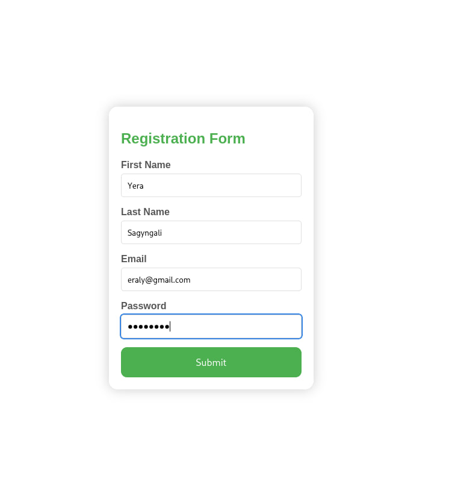
  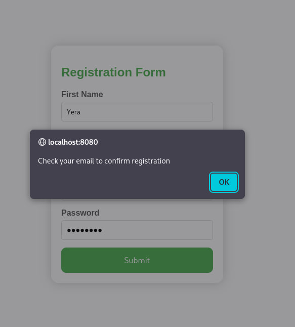
</p>

### Email Confirmation (MailDev)
<p align="center">
  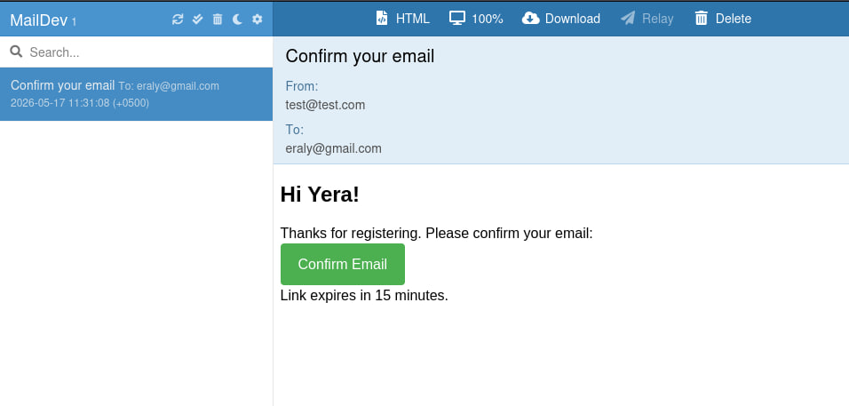
  
</p>

### Database — User Record
<p align="center">
  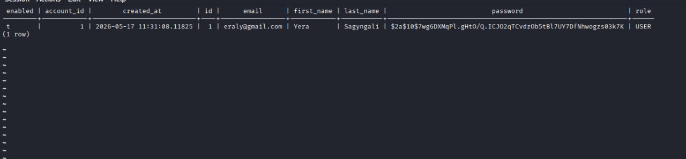
</p>

### SIM Card Creation
<p align="center">
  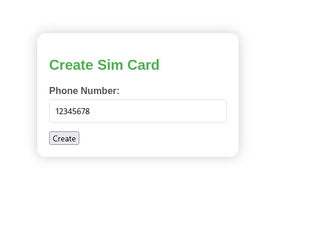
  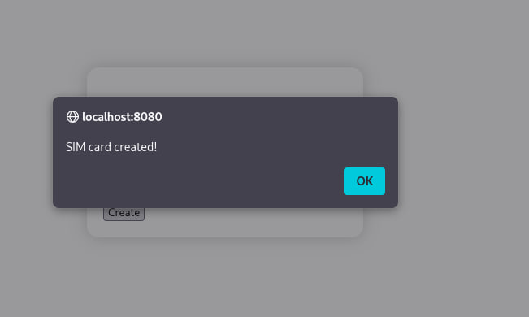
</p>

### Database — SIM Card Record
<p align="center">
  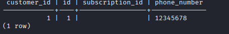
</p>

### Deposit Balance
<p align="center">
  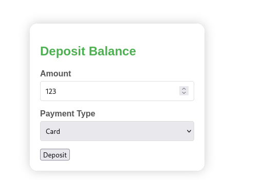
  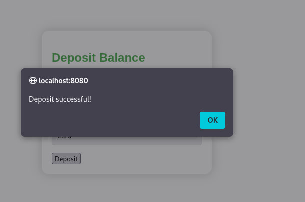
</p>

### Database — Account Balance
<p align="center">
  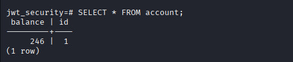
</p>

### Sign In
<p align="center">
  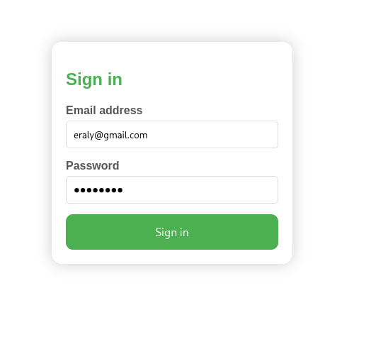
  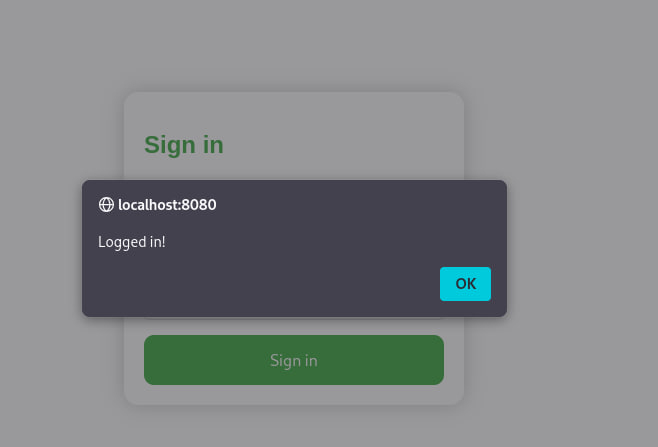
</p>

### Customer Information
<p align="center">
  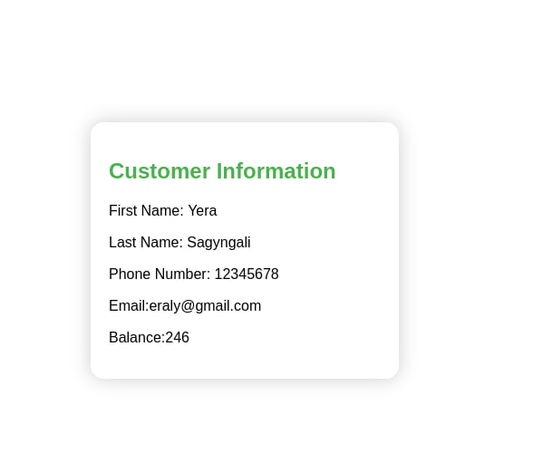
</p>

---

## Technologies

### Backend
- Java 17
- Spring Boot
- Spring Security
- JWT
- Hibernate / JPA
- PostgreSQL

### Frontend
- HTML
- CSS
- JavaScript

### DevOps / Tools
- Docker
- MailDev

---

## Features
- JWT authentication and authorization
- Email verification before account activation
- Customer registration and login
- SIM card management
- Tariff management
- Subscription creation
- Balance top-up system
- Payment history tracking
- RESTful API architecture

---

## REST API

### Auth
| Method | Endpoint | Description |
|--------|----------|-------------|
| POST | `/api/v1/auth/register` | Register a new customer |
| GET | `/api/v1/auth/confirm` | Confirm email via token |
| POST | `/api/v1/auth/login` | Login and receive JWT |

### Customer
| Method | Endpoint | Description |
|--------|----------|-------------|
| GET | `/api/v1/customer/me` | Get current customer info |

### SIM Card
| Method | Endpoint | Description |
|--------|----------|-------------|
| POST | `/api/v1/sim` | Create a new SIM card |
| GET | `/api/v1/sim` | Get customer's SIM cards |

### Account / Balance
| Method | Endpoint | Description |
|--------|----------|-------------|
| POST | `/api/v1/account/deposit` | Top up account balance |
| GET | `/api/v1/account/payments` | Get payment history |

### Tariff & Subscription
| Method | Endpoint | Description |
|--------|----------|-------------|
| GET | `/api/v1/tariff` | List available tariffs |
| POST | `/api/v1/subscription` | Create a subscription |
| PUT | `/api/v1/subscription/tariff` | Change tariff |
| GET | `/api/v1/subscription/traffic` | Check remaining traffic |

---

## Environment Setup

### Prerequisites
Make sure you have installed:
- Java 17
- Docker
- Docker Compose
- Git

---

### Clone Repository
```bash
git clone https://github.com/Yeraly1221/telecom_nextGeneration.git
cd telecom_nextGeneration
```

---

### Configure Environment Variables
Create `.env` file in the root directory:
```env
POSTGRES_DB=jwt_security
POSTGRES_USER=admin
POSTGRES_PASSWORD=admin
MAIL_USERNAME=test
MAIL_PASSWORD=test
```

---

## Running the Project

### With Docker
```bash
docker-compose up --build
```
The app will be available at: `http://localhost:8080`
MailDev UI will be available at: `http://localhost:1080`

### With Maven (without Docker)
```bash
./mvnw clean install
./mvnw spring-boot:run
```

> Make sure PostgreSQL is running locally before using Maven.

